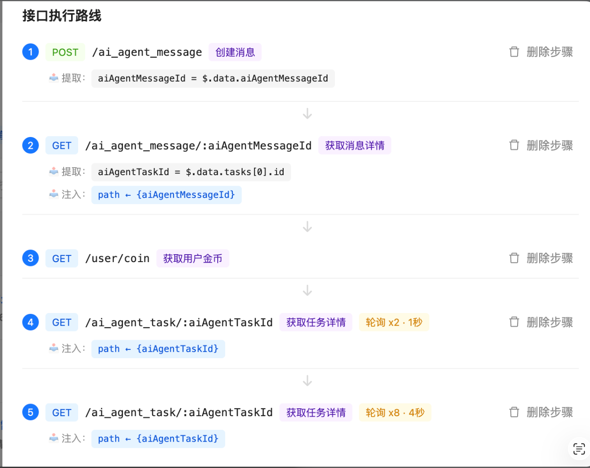
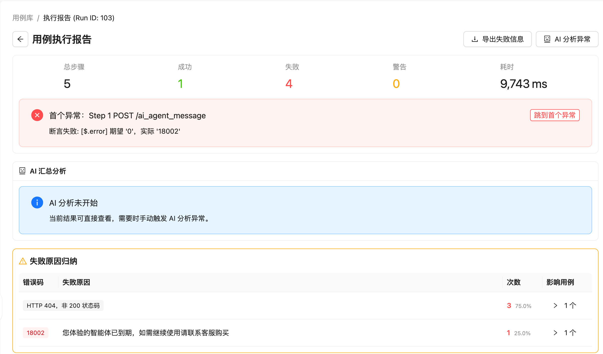

# TraceWeave AI

TraceWeave AI 是一套面向“AI 自动化抓包 + 测试工具”的开源文档包，重点不是介绍概念，而是提供一套可以直接落到工程实现的算法蓝图、Prompt 契约和实施手册。

它不提供代码脚手架，不绑定具体语言、数据库、中间件或供应商协议。它提供的是一条完整的方法链：

- 如何把原始流量变成结构化抓包资产
- 如何判断哪些请求适合回放，哪些只适合分析
- 如何把录制序列转成可维护的 `TestCase`
- 如何用 deterministic 规则和 AI 协同完成编排
- 如何执行回放、归因失败、聚合缺陷
- 如何把这些能力组织成稳定、可评估的 Prompt System

## 示例界面

下面三张图对应这个项目想表达的三个核心结果：用例编排、批量执行、执行诊断。

### 1. 用例编排链路



把原始接口调用整理成有顺序、有提取器、有注入器、有轮询策略的执行步骤。

### 2. 用例库与批量执行


围绕目录化用例库做批量运行，快速看到每次执行的结果分布。

### 3. 执行报告与异常分析



把失败集中到首个异常、失败原因归纳和 AI 分析入口上，方便继续诊断和修正。

## 适合谁

- 想从零搭一个 AI 自动化抓包与测试平台的工程师
- 想把录制流量资产化、降低手工维护成本的测试团队
- 想把 AI 引入接口分析、用例编排、回放诊断的产品团队
- 想开源同类工具，但不希望耦合到任何单一业务协议的维护者

## 这个包解决什么问题

很多团队同时拥有抓包、接口测试、日志分析和 AI 能力，但无法把它们稳定地接成一个工具：

- 抓到的请求不一定具备 replay value
- 可回放的请求序列通常缺依赖链和参数化规则
- 断言策略容易过脆或过弱
- AI 生成建议容易越权、幻觉或污染敏感信息
- 回放失败后只有“失败了”，没有可聚合的 defect 结论

TraceWeave AI 的目标就是解决这条链路的组织与算法问题。

## 核心能力链

```text
Capture -> Normalize -> Analyze -> Convert -> Orchestrate -> Replay -> Diagnose -> Improve
```

## 阅读顺序

如果你是第一次使用，按这个顺序读：

1. [系统总览](./docs/01-system-overview.md)
2. [领域模型与 Schema](./docs/02-domain-model-and-schemas.md)
3. [抓包与分析算法](./docs/03-capture-and-analysis-algorithms.md)
4. [录制转用例算法](./docs/04-recording-to-testcase-algorithms.md)
5. [AI 编排算法](./docs/05-ai-orchestration-algorithms.md)
6. [回放运行时与报告](./docs/06-replay-runtime-and-reporting.md)
7. [Prompt 工程包](./docs/07-prompt-engineering-pack.md)
8. [实施手册](./docs/08-implementation-playbook.md)

## 文档结构

- [01-system-overview](./docs/01-system-overview.md): 组件边界、职责、数据流、AI 参与边界
- [02-domain-model-and-schemas](./docs/02-domain-model-and-schemas.md): 通用模型、字段语义、生命周期
- [03-capture-and-analysis-algorithms](./docs/03-capture-and-analysis-algorithms.md): 抓包标准化、回放可行性、聚类、文档补全、异常检测
- [04-recording-to-testcase-algorithms](./docs/04-recording-to-testcase-algorithms.md): 序列切片、依赖链识别、变量提取注入、断言合成
- [05-ai-orchestration-algorithms](./docs/05-ai-orchestration-algorithms.md): 编排流水线、Patch 合并、置信度治理、人工接管
- [06-replay-runtime-and-reporting](./docs/06-replay-runtime-and-reporting.md): 执行器、重试超时、失败归因、缺陷聚合、报告模型
- [07-prompt-engineering-pack](./docs/07-prompt-engineering-pack.md): 多角色 Prompt 契约、失败模式、评估规则
- [08-implementation-playbook](./docs/08-implementation-playbook.md): 7 天版本、30 天版本、阶段验收、常见失败点

## 使用方式

这套文档推荐这样使用：

1. 先用 `01` 和 `02` 统一术语、边界和模型。
2. 用 `03` 到 `06` 决定 deterministic engine 的最低实现。
3. 用 `07` 设计 AI runtime 的角色拆分和输出契约。
4. 用 `08` 决定 MVP、V1、V2、V3 的实施顺序。

如果你只想尽快把一个能跑的版本搭出来，优先读：

- [README](./README.md)
- [04-recording-to-testcase-algorithms](./docs/04-recording-to-testcase-algorithms.md)
- [05-ai-orchestration-algorithms](./docs/05-ai-orchestration-algorithms.md)
- [08-implementation-playbook](./docs/08-implementation-playbook.md)

## 边界

- 不包含任何真实流量样本、凭据、环境值或业务接口路径
- 不假设固定鉴权方式、固定状态码语义或固定 Header 套件
- 不绑定到任何单一技术栈
- 优先解释“怎么做”，而不是只解释“是什么”

## 开源协作

- 许可见 [LICENSE.md](./LICENSE.md)
- 贡献规则见 [CONTRIBUTING.md](./CONTRIBUTING.md)
- 路线图见 [ROADMAP.md](./ROADMAP.md)
