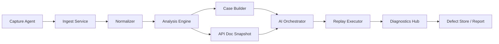

# 系统总览

## 目标

TraceWeave AI 关注的是一条完整工具链：从原始抓包进入系统，到最终输出可回放用例、失败归因和缺陷聚合结果。

这不是一个单一模块，而是八类能力的协作：

- `Capture Agent`
- `Ingest Service`
- `Normalizer`
- `Analysis Engine`
- `Case Builder`
- `AI Orchestrator`
- `Replay Executor`
- `Diagnostics Hub`

## 端到端流程

## 组件边界

| 组件 | 输入 | 输出 | 核心职责 | 不负责的事 |
| --- | --- | --- | --- | --- |
| Capture Agent | 原始网络事件 | 抓包记录 | 尽可能完整地采集请求、响应和时间信息 | 不做业务推断 |
| Ingest Service | 抓包记录 | 原始交换记录 | 接收、校验、落库、补基础元数据 | 不改写协议语义 |
| Normalizer | 原始交换记录 | `NormalizedExchange` | URL 归一、Header 分类、Body 解析、脱敏 | 不做依赖链判断 |
| Analysis Engine | `NormalizedExchange` 集合 | 聚类、文档快照、异常信号 | 找模式、找漂移、找回放价值 | 不产出最终用例 |
| Case Builder | 归一化交换 + 分析结果 | `TestCase` 草案 | 切片、建 DAG、提取变量、生成断言 | 不做开放式语义脑补 |
| AI Orchestrator | `TestCase` 草案 + 文档快照 | `AiPatchProposal`、增强用例 | 处理低确定性决策点 | 不绕过 deterministic 规则 |
| Replay Executor | 增强后的 `TestCase` | `ExecutionRun`、`ExecutionLog` | 调度执行、注入上下文、记录结果 | 不直接改写用例 |
| Diagnostics Hub | 执行日志 + 历史记录 | 缺陷结论、修复建议、聚合结果 | 失败归因、defect hash、趋势分析 | 不直接发起重放 |

## deterministic 与 AI 的分工

### 必须 deterministic 的部分

- URL canonicalization
- Header 分类
- Replay Readiness 判定
- 依赖链的显式引用识别
- 变量注入顺序
- 幂等与非幂等重试策略
- 缺陷聚合 hash 计算

### 允许 AI 参与的部分

- 变量语义命名
- 弱语义断言建议
- 文档说明文本
- 隐式依赖补全建议
- 回放失败解释
- 修复优先级建议

### AI 不应该直接控制的部分

- 真实请求发送
- 凭据处理
- 敏感 Header 回填
- 高风险 patch 自动合并
- 无证据的路径模板推断

## 运行边界

### 状态边界

- 抓包阶段保存事实，不保存推断
- 分析阶段保存中间结论，但不污染原始事实
- 编排阶段只能以 patch 形式提交建议
- 回放阶段产生新的运行时事实，与原录制事实隔离
- 缺陷聚合阶段不能反向覆盖原始日志

### 失败边界

| 阶段 | 典型失败 | 处理方式 |
| --- | --- | --- |
| Capture | 数据不完整、响应缺失 | 记录不完整标记，允许只做分析 |
| Normalize | Body 无法解析 | 降级为原始文本并附解析失败原因 |
| Analyze | 聚类不稳定 | 保留未归类样本，不强行合并 |
| Case Builder | 依赖链不完整 | 标记 `待人工确认`，不要伪造变量 |
| AI Orchestrator | 输出结构非法 | 整体拒收，保留原草案 |
| Replay | 上游 step 失败 | 根据依赖图短路后续 step |
| Diagnostics | 证据不足 | 输出低置信结论，不聚合为稳定 defect |

## 最小闭环

一个真正有用的最小版本，不要求一次性具备所有模块，但必须形成闭环：

1. 收到抓包
2. 标准化
3. 判定是否可回放
4. 构造成用例草案
5. 在新上下文中重放
6. 输出结构化报告

如果一个系统只有抓包和展示，没有从步骤 3 到步骤 6 的闭环，它更接近观察工具，不是自动化测试工具。
