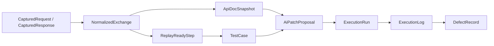

# 领域模型与 Schema

## 建模原则

- 先定义事实模型，再定义推断模型
- 先定义最小可用字段，再定义增强字段
- 模型语义独立于数据库和编程语言
- 运行时数据与录制数据分层

## 模型清单

- `CapturedRequest`
- `CapturedResponse`
- `NormalizedExchange`
- `ApiDocSnapshot`
- `ReplayReadyStep`
- `TestCase`
- `StepExtractor`
- `StepInjector`
- `AssertionRule`
- `ExecutionRun`
- `ExecutionLog`
- `DefectRecord`
- `AiPatchProposal`

## CapturedRequest

### 最小可用字段集

| 字段 | 含义 | 必填 |
| --- | --- | --- |
| `requestId` | 单次请求唯一标识 | 是 |
| `method` | HTTP method 或等价协议动作 | 是 |
| `url` | 原始请求地址 | 是 |
| `headers` | 原始请求头映射 | 是 |
| `bodyRaw` | 原始请求体 | 否 |
| `timestamp` | 发送时间 | 是 |

### 增强字段集

| 字段 | 含义 |
| --- | --- |
| `bodyParsed` | 解析后的结构体 |
| `contentType` | 推断后的内容类型 |
| `source` | 抓包来源 |
| `traceId` | 关联链路标识 |
| `connectionMeta` | 连接层元信息 |

## CapturedResponse

### 最小可用字段集

| 字段 | 含义 | 必填 |
| --- | --- | --- |
| `requestId` | 对应请求 ID | 是 |
| `status` | 响应状态或协议结果码 | 否 |
| `headers` | 原始响应头 | 否 |
| `bodyRaw` | 原始响应体 | 否 |
| `timestamp` | 接收时间 | 否 |

### 增强字段集

| 字段 | 含义 |
| --- | --- |
| `bodyParsed` | 结构化响应体 |
| `latencyMs` | 请求到响应的耗时 |
| `sizeBytes` | 载荷大小 |
| `transportError` | 传输层错误信息 |

## NormalizedExchange

### 语义

`NormalizedExchange` 是一条抓包交换的标准表示，是后续分析、编排和回放的主要输入。

### 核心字段

| 字段 | 含义 | 必填 |
| --- | --- | --- |
| `exchangeId` | 标准化后的交换 ID | 是 |
| `request` | 归一化请求 | 是 |
| `response` | 归一化响应 | 否 |
| `templatePath` | 路径模板，如 `/orders/{id}` | 否 |
| `headerBuckets` | Header 分类结果 | 否 |
| `bodyShape` | Body 结构摘要 | 否 |
| `replayReadiness` | 回放可行性判定结果 | 是 |
| `sensitivityFlags` | 敏感内容标记 | 否 |

## ApiDocSnapshot

| 字段 | 含义 |
| --- | --- |
| `endpointKey` | 接口模板键 |
| `methods` | 观察到的 method 集 |
| `pathParams` | 推断路径参数 |
| `queryFields` | 推断查询参数 |
| `headerFields` | 推断请求头字段 |
| `requestShape` | 请求体结构快照 |
| `responseShape` | 响应体结构快照 |
| `examples` | 低敏示例摘要 |
| `confidence` | 文档快照置信度 |

## ReplayReadyStep

| 字段 | 含义 |
| --- | --- |
| `stepId` | 步骤 ID |
| `name` | 步骤名 |
| `requestTemplate` | 参数化后的请求模板 |
| `extractors` | 输出提取规则 |
| `injectors` | 输入注入规则 |
| `assertions` | 断言列表 |
| `dependsOn` | 前置步骤 ID 列表 |
| `riskLevel` | 回放风险等级 |
| `replayPolicy` | 超时、重试、并发限制 |

## TestCase

| 字段 | 含义 |
| --- | --- |
| `caseId` | 用例 ID |
| `title` | 用例标题 |
| `goal` | 验证目标 |
| `steps` | `ReplayReadyStep` 列表 |
| `fixtures` | 初始上下文变量 |
| `labels` | 标签、场景、域 |
| `sourceTraceRefs` | 来源抓包引用 |
| `docRefs` | 关联文档快照 |
| `confidence` | 用例整体置信度 |
| `reviewState` | 自动通过、待人工确认、已人工确认 |

## StepExtractor

| 字段 | 含义 |
| --- | --- |
| `extractorId` | 提取器 ID |
| `source` | 来源位置，如 response body |
| `path` | 提取路径 |
| `variableName` | 输出变量名 |
| `required` | 缺失是否致命 |
| `confidence` | 提取可信度 |
| `sensitivity` | 是否可能泄露敏感值 |

## StepInjector

| 字段 | 含义 |
| --- | --- |
| `injectorId` | 注入器 ID |
| `target` | 注入位置，如 path/query/header/body |
| `path` | 注入路径 |
| `variableName` | 引用变量名 |
| `required` | 缺失是否阻塞执行 |
| `defaultPolicy` | 缺失时如何降级 |

## AssertionRule

| 字段 | 含义 |
| --- | --- |
| `assertionId` | 断言 ID |
| `type` | 状态、结构、关系、弱语义等类型 |
| `subject` | 断言对象路径 |
| `operator` | 比较方式 |
| `expected` | 期望值或模式 |
| `severity` | 失败严重级别 |
| `volatility` | 波动级别 |
| `source` | 来自规则还是 AI 建议 |

## ExecutionRun

| 字段 | 含义 |
| --- | --- |
| `runId` | 单次执行 ID |
| `caseId` | 对应用例 |
| `startedAt` | 开始时间 |
| `endedAt` | 结束时间 |
| `status` | 成功、失败、中止、部分完成 |
| `runtimeContext` | 本次执行的上下文快照 |
| `summary` | 聚合摘要 |

## ExecutionLog

| 字段 | 含义 |
| --- | --- |
| `runId` | 所属执行 |
| `stepId` | 所属步骤 |
| `requestResolved` | 注入后的实际请求 |
| `responseObserved` | 执行后的实际响应 |
| `assertionResults` | 断言结果 |
| `failureClass` | 失败类别 |
| `evidence` | 关键证据 |

## DefectRecord

| 字段 | 含义 |
| --- | --- |
| `defectKey` | 缺陷聚合键 |
| `signature` | 失败签名 |
| `failureClass` | 失败分类 |
| `firstSeenAt` | 首次出现 |
| `lastSeenAt` | 最近出现 |
| `affectedCases` | 关联用例 |
| `evidenceSet` | 代表性证据 |
| `confidence` | 聚合可信度 |

## AiPatchProposal

| 字段 | 含义 |
| --- | --- |
| `proposalId` | patch ID |
| `targetObject` | 作用对象，如 testcase/step/assertion |
| `targetPath` | 精确作用路径 |
| `operation` | add/update/remove/suggest |
| `proposedValue` | 建议值 |
| `rationale` | 依据 |
| `evidenceRefs` | 证据引用 |
| `confidence` | 置信度 |
| `riskLevel` | 风险等级 |

## 生命周期

## 关键约束

1. 原始事实模型不能被 AI patch 直接覆盖。
2. `NormalizedExchange` 是分析和回放的共同输入，避免维护两套事实源。
3. `AiPatchProposal` 只能提出建议，不能直接成为最终事实。
4. `ExecutionLog` 记录新一次执行事实，不能回写为原录制事实。
