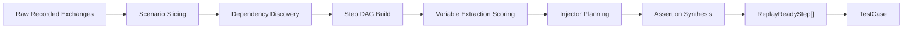

# 录制转用例算法

## 目标

把一段原始录制请求序列转换成稳定、可重放、可维护的 `TestCase`。这一步是整个系统的第一条主干算法链。

## 总流程



## 输入与输出

### 输入

- 同一次录制中的 `NormalizedExchange[]`
- 聚类结果
- 文档快照

### 输出

- `TestCase`
- `ReplayReadyStep[]`
- `StepExtractor[]`
- `StepInjector[]`
- `AssertionRule[]`

## 算法 1: 请求序列切片

### 目标

把一整段录制流量切成能表达一个可验证意图的场景，而不是简单按时间顺序全收。

### 输入

- 有时间顺序的 `NormalizedExchange[]`
- 页面、操作、trace、事件标记等上下文

### 输出

- 场景边界
- 候选场景列表

### 切片信号

- 明确的用户操作起点
- 明显的 trace 变化
- 页面或上下文切换
- 长时间空窗
- 独立资源域切换
- 依赖链断裂

### 规则

1. 先按 trace 或交互边界切粗片。
2. 在粗片内部移除静态资源和纯观测请求。
3. 找到第一个具备业务意图的“主请求”。
4. 向前回收必要依赖，向后回收验证性请求。
5. 如果中段出现新的意图主请求，断开为新场景。

### 伪代码

```text
function sliceScenario(exchanges):
  windows = splitByInteractionOrIdleGap(exchanges)
  scenarios = []
  for window in windows:
    useful = filterOutStaticAndAnalysisOnly(window)
    anchors = findIntentAnchors(useful)
    for anchor in anchors:
      scenario = expandAroundAnchor(useful, anchor)
      if hasCoherentGoal(scenario):
        scenarios.append(scenario)
  return scenarios
```

### 常见误判

- 把多个相邻操作混成一个场景
- 把前置依赖请求误删
- 把纯轮询请求错误当成主动作

## 算法 2: 依赖链识别

### 目标

识别“谁生产变量，谁消费变量”，并构建 step DAG，而不是只构建线性请求序列。

### 依赖来源

- 响应字段进入后续 path
- 响应字段进入后续 query
- 响应字段进入后续 header
- 响应字段进入后续 body
- 上一请求中的回显字段进入下一请求

### 证据优先级

```text
显式值匹配 > 文档字段匹配 > 同名字段匹配 > 位置相似推断 > 纯语义猜测
```

### 构图步骤

1. 为每个 step 收集候选生产字段和候选消费字段。
2. 对任意生产者 `P` 与消费者 `C` 计算依赖得分。
3. 超过阈值的连边进入候选图。
4. 对候选图去环、去冗余边。
5. 产出最小依赖 DAG。

### 依赖得分公式

```text
dependency_score =
  exact_value_match
  + field_name_similarity
  + structural_position_match
  + temporal_proximity
  + doc_hint
  - sensitivity_penalty
  - randomness_penalty
```

### 阈值建议

- `>= 0.85`: 自动建边
- `0.6 ~ 0.85`: 建议建边并标 `待人工确认`
- `< 0.6`: 不建边

### 伪代码

```text
function buildDependencyDag(steps):
  candidateEdges = []
  for producer in steps:
    producedVars = enumerateProducedFields(producer)
    for consumer in steps after producer:
      consumedSlots = enumerateConsumedSlots(consumer)
      for var in producedVars:
        for slot in consumedSlots:
          score = dependencyScore(var, slot, producer, consumer)
          if score >= 0.6:
            candidateEdges.append({producer, consumer, var, slot, score})
  pruned = pruneCyclesAndRedundantEdges(candidateEdges)
  return buildDag(pruned)
```

## 算法 3: 变量提取候选评分

### 目标

不是所有响应字段都应该变成变量。需要筛出“值得传播”的字段。

### 打分公式

```text
score =
  producer_confidence
  + consumer_match
  + structural_stability
  + repetition_gain
  - sensitivity_penalty
  - randomness_penalty
```

### 因子解释

| 因子 | 含义 |
| --- | --- |
| `producer_confidence` | 字段是否稳定出现在响应中 |
| `consumer_match` | 是否被后续请求消费，消费位置是否合理 |
| `structural_stability` | 字段路径和类型是否稳定 |
| `repetition_gain` | 多次录制中是否反复形成同样依赖 |
| `sensitivity_penalty` | 是否疑似令牌、凭据、设备身份 |
| `randomness_penalty` | 是否明显随机、一次性、不可泛化 |

### 阈值建议

- `>= 0.8`: 自动采用
- `0.5 ~ 0.8`: `待人工确认`
- `< 0.5`: 丢弃

### 规则补充

- 长随机串默认高惩罚，除非有强消费者证据
- 只出现一次且没有消费者的字段不提取
- 敏感字段即使高分，也只能做局部运行时变量，不能沉淀为通用变量

### 伪代码

```text
function selectExtractors(producedFields, futureConsumers, historicalTraces):
  extractors = []
  for field in producedFields:
    score =
      scoreProducerConfidence(field, historicalTraces)
      + scoreConsumerMatch(field, futureConsumers)
      + scoreStructuralStability(field, historicalTraces)
      + scoreRepetitionGain(field, historicalTraces)
      - scoreSensitivity(field)
      - scoreRandomness(field)
    if score >= 0.8:
      extractors.append(autoExtractor(field, score))
    else if score >= 0.5:
      extractors.append(reviewExtractor(field, score))
  return extractors
```

## 算法 4: 变量注入排序

### 目标

确定变量该注入到哪里，以及多个注入点冲突时怎么处理。

### 默认优先级

```text
path placeholder > query > header > body
```

### 原因

- path 注入通常决定资源定位，优先级最高
- query 次之，常用于检索和过滤
- header 往往控制上下文，但更容易受环境影响
- body 最灵活，但结构复杂，冲突最多

### 冲突规则

1. 同一变量同时命中多个 path 段，只保留结构上最窄的那个。
2. 同一变量既可注入 query 又可注入 body，优先遵循文档快照和历史多数路径。
3. 敏感变量禁止跨作用域注入。
4. 缺失变量时，path 缺失直接阻塞；body 缺失可按策略降级。

### 伪代码

```text
function planInjectors(variableCandidates, requestTemplate, docSnapshot):
  slots = findAllInjectableSlots(requestTemplate)
  ranked = rankSlots(slots, ["path", "query", "header", "body"], docSnapshot)
  injectors = []
  for variable in variableCandidates:
    matches = scoreMatches(variable, ranked)
    best = resolveConflict(matches, docSnapshot)
    if best:
      injectors.append(makeInjector(variable, best))
  return injectors
```

## 算法 5: 断言生成

### 目标

自动断言必须兼顾稳健性和有效性，不能一味追求字段全等。

### 断言类型

- 状态断言
- 结构断言
- 关系断言
- 数量级断言
- 弱语义断言
- 波动字段豁免

### 生成顺序

1. 总是先生成状态断言。
2. 对稳定字段生成结构断言。
3. 对生产者字段和消费者字段生成关系断言。
4. 对明显波动字段加豁免。
5. 对低确定性业务语义留给 AI 建议。

### 波动字段识别

- 时间戳
- 请求 ID
- 追踪 ID
- 随机数
- 单次签名

### 断言强度建议

| 情况 | 建议断言 |
| --- | --- |
| 字段 99% 稳定 | 精确值或枚举断言 |
| 字段类型稳定但值波动 | 类型或模式断言 |
| 字段只用于依赖传递 | 关系断言 |
| 字段高波动且无业务价值 | 豁免 |

## Walkthrough: 从 8 条原始请求生成 TestCase

### 原始序列

1. 获取列表
2. 获取列表附带的筛选元数据
3. 读取某个资源详情
4. 读取资源相关子对象
5. 提交编辑请求
6. 查询提交结果
7. 轮询任务状态
8. 读取更新后的资源详情

### 转换过程

1. 切片阶段识别第 5 条是主意图锚点，场景目标是“编辑某个资源并验证结果”。
2. 第 1 到 4 条中，第 3 条响应产出的资源主键被第 5、6、8 条消费，建立主依赖边。
3. 第 5 条响应产出的任务标识被第 6、7 条消费，建立任务依赖边。
4. 第 1、2 条被判定为辅助上下文，保留但不作为核心验证步骤。
5. 从第 3 条提取 `resource_id`，从第 5 条提取 `task_id`。
6. 对第 5 条 body 中的资源引用做 path/body 双检查，最终选择 path 为主定位、body 为次级参数。
7. 断言层面：
   - 第 5 条断言提交成功
   - 第 7 条断言任务进入完成态
   - 第 8 条断言更新后的结构满足预期

### 生成结果

- `steps`: 6 个核心 step
- `extractors`: `resource_id`, `task_id`
- `injectors`: 资源路径注入、任务查询注入
- `assertions`: 状态断言 3 个，结构断言 2 个，关系断言 2 个
- `reviewState`: 自动通过，但第 8 条结构中一个弱语义字段标记 `待人工确认`

## 人工接管规则

- 依赖图出现环
- 提取候选全是高敏字段
- 主请求锚点不明确
- 断言只能依赖弱语义文本
- 一个场景里存在多个竞争性目标

出现以上情况时，不要继续自动合成“看起来像用例”的结果，应该降级为场景草案并要求人工拆分或确认。
