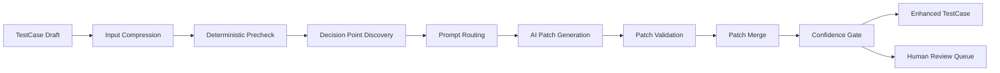

# AI 编排算法

## 目标

AI 编排层只解决 deterministic engine 无法稳定解决、但又值得自动化的决策点。它不是规则引擎的替代品，而是规则引擎的受控补充层。

## 允许 AI 处理的三类任务

1. 补语义：变量命名、场景标题、接口说明
2. 补 patch：隐式依赖、弱断言、文档快照增强
3. 补解释：失败解释、修复建议、低置信原因

## 不允许 AI 直接处理的任务

- 跳过 deterministic 规则直接输出最终用例
- 透传敏感 Header、Token、Cookie
- 在无证据情况下创造路径模板
- 直接覆盖事实模型
- 自动接受高风险 patch

## 主流程



## 算法 1: 输入压缩

### 目标

给 AI 的输入必须是受控、压缩、脱敏、可证据引用的，而不是整段原始流量。

### 输入

- `TestCase` 草案
- `ApiDocSnapshot`
- `NormalizedExchange` 证据引用

### 输出

- `AiContextPack`

### 压缩原则

- 只保留与当前决策点相关的 step
- 用模板路径代替原始路径
- 只保留字段摘要，不保留全量敏感值
- 用 `evidenceRef` 引用原始证据，不把原始内容直接灌给模型

### 伪代码

```text
function buildAiContextPack(testcaseDraft, docSnapshots, decisionPoint):
  relevantSteps = selectRelevantSteps(testcaseDraft, decisionPoint)
  compressedSteps = redactAndCompress(relevantSteps)
  evidenceRefs = collectEvidenceRefs(relevantSteps, decisionPoint)
  docHints = selectRelevantDocs(docSnapshots, decisionPoint)
  return {decisionPoint, compressedSteps, docHints, evidenceRefs}
```

## 算法 2: 待决策点识别

### 目标

只有真正低确定性的节点才送给 AI，避免模型参与不必要决策。

### 决策点类型

- 变量命名低质量
- 依赖边置信度处于灰区
- 断言只能做到结构层，缺少语义层
- 文档字段存在缺口
- 回放失败缺少高层解释

### 判定规则

| 条件 | 动作 |
| --- | --- |
| deterministic 置信度 >= 0.9 | 不送 AI |
| 0.6 <= 置信度 < 0.9 且存在证据 | 送 AI 请求 patch |
| 置信度 < 0.6 且证据不足 | 直接人工确认，不送 AI |

## 算法 3: Prompt 路由

### 目标

不同决策点由不同角色处理，避免一个通用 Prompt 做所有事情。

### 路由表

| 决策点 | 角色 |
| --- | --- |
| 字段命名与说明 | `api doc curator` |
| 隐式依赖补全 | `testcase orchestrator` |
| 断言增强 | `assertion synthesizer` |
| 回放失败解释 | `replay diagnostician` |
| 缺陷聚合建议 | `defect triager` |
| 抓包异常理解 | `capture analyst` |

### 规则

- 一个决策点默认只路由一个主角色
- 高风险决策允许第二角色复核
- 角色输出必须结构化，不能只返回自然语言建议

## 算法 4: AI Patch 生成

### Patch 结构

- `targetObject`
- `targetPath`
- `operation`
- `proposedValue`
- `rationale`
- `evidenceRefs`
- `confidence`
- `riskLevel`

### 生成约束

1. 只能输出字段级 patch。
2. 所有 patch 必须引用证据。
3. 无证据时只能输出 `suggest`，不能输出 `update`。
4. 涉及敏感变量时风险等级自动提升。

## 算法 5: Patch 校验

### 目标

任何 AI 输出都要过结构、证据、权限和风险四道门。

### 校验维度

- 结构合法性：JSON/Markdown 结构是否符合契约
- 目标合法性：`targetPath` 是否存在
- 证据合法性：`evidenceRefs` 是否真实可追踪
- 权限合法性：是否触碰禁区字段
- 风险合法性：高风险 patch 是否要求人工确认

### 伪代码

```text
function validatePatch(proposal, testcaseDraft, evidenceIndex):
  if not isStructured(proposal):
    return reject("invalid_structure")
  if not targetExists(proposal.targetPath, testcaseDraft):
    return reject("invalid_target")
  if not evidenceBacked(proposal.evidenceRefs, evidenceIndex):
    return reject("missing_evidence")
  if touchesSensitiveZone(proposal):
    return reject("sensitive_zone")
  if proposal.confidence < 0.6:
    return escalate("low_confidence")
  return accept()
```

## 算法 6: Patch 合并

### Merge Policy

- 字段级 patch，不允许整对象覆盖
- `add` 只能加在白名单位置
- `update` 必须保留原值与建议值对照
- `remove` 默认不自动生效，除非 deterministic 规则也支持删除
- 高风险 patch 只进入 review queue

### 置信度顺序

```text
deterministic > retrieved_doc > multi-trace evidence > single-trace inference > pure LLM guess
```

### 合并规则

1. 如果 deterministic 已有结果，AI 不能覆盖，只能附加建议。
2. 多个 patch 命中同一路径，按置信度和证据强度排序。
3. 冲突 patch 同时保留，但最高只能有一个进入候选主值。
4. 风险高或置信度灰区的 patch 进入人工确认队列。

### 伪代码

```text
function mergePatches(baseTestcase, acceptedPatches):
  merged = clone(baseTestcase)
  reviewQueue = []
  ordered = sortByEvidenceAndConfidence(acceptedPatches)
  for patch in ordered:
    if conflictsWithDeterministicFact(patch, merged):
      reviewQueue.append(markConflict(patch, "deterministic_override"))
      continue
    if patch.riskLevel == "high":
      reviewQueue.append(markConflict(patch, "high_risk"))
      continue
    merged = applyFieldLevelPatch(merged, patch)
  return {merged, reviewQueue}
```

## AI 失败处理

| 失败类型 | 处理 |
| --- | --- |
| 空输出 | 直接拒收，记录角色失败 |
| 输出结构不合法 | 直接拒收，不尝试自动修复 |
| 自相矛盾 | 进入复核队列 |
| 引入敏感字段 | 拒收并记录越权 |
| 无证据强推断 | 降为 `suggest` 或人工确认 |

## 反例表：AI 不该做什么

| 错误行为 | 为什么不行 | 正确处理 |
| --- | --- | --- |
| 直接把随机串命名为业务主键 | 没有证据，可能污染依赖链 | 保留低置信建议 |
| 用整段 body 覆盖现有 step | 破坏字段级可审计性 | 只提交字段级 patch |
| 发现断言难写就删除断言 | 会降低用例价值 | 标记灰区并请求人工确认 |
| 看到失败就建议无限重试 | 混淆根因和恢复策略 | 先分类失败，再建议策略 |

## 场景 walkthrough

场景：系统已经通过 deterministic 规则构造出一个 `TestCase`，但有两个灰区：

1. 某个步骤的资源标识字段名字很差，只叫 `value_1`
2. 最后一个响应里有一个稳定文本字段，可能适合做弱语义断言

处理流程：

1. 编排器识别两个决策点。
2. 决策点一送给 `api doc curator`，输出变量命名 patch。
3. 决策点二送给 `assertion synthesizer`，输出断言 patch。
4. 两个 patch 都通过结构校验。
5. 变量命名 patch 置信度高，直接合并。
6. 断言 patch 有证据但语义较弱，合并为 `待人工确认`。

## 人工接管规则

- patch 冲突触碰关键路径
- AI 建议与 deterministic 结果正面冲突
- 同一决策点连续两次模型输出不一致
- 模型持续引入敏感字段或越权建议
- 证据不足但业务影响很高

这类情况不要继续迭代 Prompt 试图“蒙对”，应直接切到人工确认。
