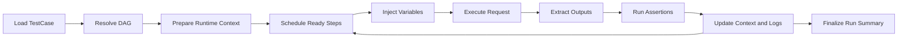

# 回放运行时与报告

## 目标

这一层负责把 `TestCase` 真正执行起来，并把结果转成可诊断、可聚合、可追踪的运行事实。

## 运行时模型

### Runtime Context

| 字段 | 含义 |
| --- | --- |
| `runId` | 本次执行唯一标识 |
| `caseId` | 对应用例 |
| `globalVars` | 用例级共享变量 |
| `stepVars` | 步骤级局部变量 |
| `policy` | 超时、重试、并发策略 |
| `evidenceRefs` | 本次执行产生的证据索引 |

### 变量作用域

- `fixture scope`: 用例启动前已知变量
- `run scope`: 执行中全局传播变量
- `step scope`: 单个 step 临时变量
- `ephemeral scope`: 只在单次请求解析中存在

## 调度流程



## 算法 1: DAG 调度

### 规则

1. 没有前置依赖的 step 先入 ready queue。
2. 每个 step 完成后，释放其后继节点。
3. 若某 step 失败且后继强依赖它，后继直接短路。
4. 弱依赖失败可按策略继续。

### 伪代码

```text
function scheduleSteps(stepDag):
  readyQueue = allNodesWithoutDependencies(stepDag)
  while readyQueue not empty:
    step = popNext(readyQueue)
    result = executeStep(step)
    updateGraph(stepDag, step, result)
    readyQueue.addAll(newlyUnblockedNodes(stepDag))
  return summarize(stepDag)
```

## 算法 2: 重试与超时策略

### 核心原则

- 幂等请求和非幂等请求必须区别对待
- 默认保守，避免通过重试掩盖真实缺陷

### 决策表

| 请求属性 | 建议重试 |
| --- | --- |
| 幂等且网络失败 | 可有限重试 |
| 幂等且断言失败 | 默认不重试 |
| 非幂等且网络失败 | 默认不自动重试 |
| 非幂等且服务端显式可重放 | 需显式策略允许 |

### 超时策略

- 连接超时、响应超时、整体 step 超时分开控制
- 轮询类 step 允许更长总时限，但单次间隔必须受控
- 任何超时都需要记录是哪一层触发的

## 算法 3: 输出提取与上下文更新

### 步骤

1. 对响应运行 `StepExtractor`
2. 过滤掉敏感或不稳定变量
3. 写入 `run scope` 或 `step scope`
4. 将提取结果写入 `ExecutionLog`

### 关键约束

- 不允许 extractor 覆盖已有高可信全局变量
- 同名变量冲突时，保留更高可信来源并记录冲突

## 算法 4: 失败归因

### 失败层级

- `network_failure`
- `protocol_failure`
- `dependency_failure`
- `assertion_failure`
- `schema_break`
- `runtime_policy_abort`

### 归因顺序

1. 先看是否根本没有拿到响应
2. 再看协议层是否失败
3. 再看前置变量是否缺失
4. 再看响应结构是否破坏
5. 最后看断言层

### 伪代码

```text
function classifyFailure(stepLog):
  if noResponse(stepLog):
    return network_failure
  if protocolBroken(stepLog):
    return protocol_failure
  if missingRequiredDependency(stepLog):
    return dependency_failure
  if responseShapeBroken(stepLog):
    return schema_break
  if assertionFailed(stepLog):
    return assertion_failure
  return runtime_policy_abort
```

## 算法 5: 缺陷聚合 hash

### 目标

把看起来不同、实则同根因的失败聚到一起。

### defect key 构成

```text
defect_key =
  normalized_request_template
  + failure_class
  + critical_assertion_path
  + canonical_error_signature
```

### 聚合规则

1. 使用模板路径，不使用真实资源 ID。
2. 错误消息先 canonicalize，再入 hash。
3. 只使用关键断言路径，不使用全量日志。
4. 如果 failure class 变化，不合并。

### 常见误聚合来源

- 把不同 failure class 合并
- 把动态错误消息原样入 hash
- 使用真实实例 ID 导致同类失败散开

## 报告模型

### Run Summary

- 执行状态
- 成功 step 数 / 失败 step 数
- 首个失败点
- 失败分类
- 代表性证据
- 修复建议
- 总体置信度

### Step 级报告

| 字段 | 内容 |
| --- | --- |
| `requestResolved` | 实际执行请求摘要 |
| `responseObserved` | 实际响应摘要 |
| `extractorOutputs` | 本 step 产出的变量 |
| `assertionResults` | 各断言结果 |
| `failureClass` | 失败类别 |
| `evidence` | 关键信息摘要 |

## 场景 walkthrough

场景：一个 6 step 的用例在第 4 步失败。

1. 执行器按 DAG 调度到第 4 步。
2. 注入器发现上一步已经产出所需 `task_id`，请求正常发送。
3. 响应返回成功状态，但缺失一个高稳定结构字段。
4. 归因算法先排除网络与协议层，再命中 `schema_break`。
5. 报告层输出：
   - 首个失败点：step 4
   - 失败类型：`schema_break`
   - 关键证据：字段路径缺失
   - defect key：基于模板路径和缺失字段路径生成

## 人工接管规则

- 同一 run 出现多个互相竞争的根因
- 缺陷聚合结果频繁抖动
- 幂等判定不清晰却触发自动重试
- 关键证据需要查看原始载荷全文才能判断

这些情况说明当前模型和策略还不够稳定，应人工复核而不是继续自动归并。
