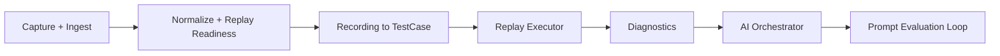

# 实施手册

## 目标

这份文档不是泛泛 checklist，而是一份可以指导外部团队从零搭出结果的落地蓝图。核心原则是：先把 deterministic 主干做出来，再把 AI 插到真正值得插的地方。

## 总体实施顺序



## 阶段 1: MVP

### 目标产出

- 可接收抓包数据
- 可标准化为 `NormalizedExchange`
- 可判定 `ready / conditional / analysis_only`
- 可手工选择一段场景并回放
- 可输出最小执行报告

### 必要模块

- Capture ingest
- Normalizer
- Replay readiness scorer
- 最简 replay executor
- 基础报告层

### 输入输出

- 输入：原始抓包事件
- 输出：`NormalizedExchange`、基础回放结果、基础失败分类

### 最低验收标准

- 同模板请求可以聚类
- 能稳定筛出仅分析请求
- 能回放至少一个无复杂依赖的场景

### 常见失败点

- 直接跳过标准化
- 把所有请求都当可回放
- 用原始动态路径做模板键

### 不该提前做的事

- 不要先做复杂 Prompt
- 不要先做缺陷聚合平台化界面

## 阶段 2: V1

### 目标产出

- 自动把录制转成 `TestCase`
- 能生成 step DAG、extractor、injector、assertion
- 能在新运行上下文里重放

### 必要模块

- 场景切片
- 依赖链识别
- 变量提取评分
- 注入排序
- 默认断言合成

### 输入输出

- 输入：一段录制 `NormalizedExchange[]`
- 输出：`TestCase`

### 最低验收标准

- 一段 8 到 12 条的录制能自动转出有意义的用例
- 至少能识别一条资源主键依赖和一条任务依赖
- 断言误报率可控，不会被随机字段普遍击穿

### 常见失败点

- 只生成线性序列，不建 DAG
- 变量提取无评分，全量提取
- 把随机字段纳入精确断言

### 不该提前做的事

- 不要把 AI 作为依赖识别主引擎
- 不要先追求 UI，可先用文档和对象验证

## 阶段 3: V2

### 目标产出

- 接入多角色 Prompt
- deterministic 与 AI patch 流水线打通
- 低置信 patch 能进入人工确认队列
- 回放失败可生成结构化解释

### 必要模块

- Decision point discovery
- Prompt router
- Patch validator
- Patch merger
- Review queue

### 输入输出

- 输入：`TestCase` 草案 + 决策点
- 输出：增强后的 `TestCase` + patch 审核记录

### 最低验收标准

- AI 输出不合法时可被拒收
- AI 只补充灰区，不覆盖 deterministic 结果
- 至少 6 个角色 prompt 可稳定返回结构化结果

### 常见失败点

- 让一个通用 Prompt 干所有活
- 允许高风险 patch 自动生效
- 不做 evidence-based 校验

### 不该提前做的事

- 不要一开始就做多模型竞赛
- 不要先做复杂 agent workflow，而忽略 patch 契约

## 阶段 4: V3

### 目标产出

- 缺陷聚合
- Prompt 评估闭环
- 失败模式库
- 建议修复与回放复验闭环

### 必要模块

- defect hash 计算
- run 历史归并
- prompt scorecard
- 变更前后对照验证

### 输入输出

- 输入：执行历史、patch 历史、prompt 输出历史
- 输出：`DefectRecord`、Prompt 评分、迭代建议

### 最低验收标准

- 相似失败可稳定聚类
- Prompt 变更可量化评估
- 缺陷视图可支持人工快速定位

### 常见失败点

- defect key 混入动态值
- 聚合规则没有 failure class 边界
- 只看 patch 采纳率，不看误导率

## 算法 1: 能力建设排序

### 目标

决定团队先实现哪些模块，避免一开始就进入“大而全”建设。

### 评分维度

| 维度 | 含义 |
| --- | --- |
| `closure_gain` | 对闭环形成的贡献 |
| `dependency_count` | 依赖前置模块数量 |
| `implementation_cost` | 预估实现成本 |
| `observability_gain` | 对可观察性的提升 |
| `ai_dependency` | 是否依赖尚未稳定的 AI 能力 |

### 优先级公式

```text
priority_score =
  closure_gain
  + observability_gain
  - dependency_count
  - implementation_cost
  - ai_dependency
```

### 规则

- `Normalize`、`Replay Executor`、`Recording to TestCase` 通常优先级最高
- 任何强依赖 AI 才能成立的模块默认后置
- 无法提升闭环能力的“展示层工作”默认后置

### 伪代码

```text
function rankCapabilities(capabilities):
  scored = []
  for item in capabilities:
    score =
      item.closure_gain
      + item.observability_gain
      - item.dependency_count
      - item.implementation_cost
      - item.ai_dependency
    scored.append({item, score})
  return sortDesc(scored)
```

## 算法 2: MVP Scope Cutter

### 目标

在时间极紧时，从完整蓝图裁剪出一个仍能产出结果的最小能力集。

### 保留规则

必须保留：

- `Capture/Ingest`
- `Normalize`
- `Replay Readiness`
- `Scenario Slicing`
- `Basic Replay`
- `Basic Report`

可裁剪：

- 多角色 Prompt
- defect 聚合面板
- 高级断言生成
- 文档增强说明文案

### 裁剪规则

1. 如果一个模块不影响“录制 -> 用例 -> 回放 -> 报告”闭环，可暂缓。
2. 如果一个模块只能提升体验，不能提升正确性，可暂缓。
3. 如果一个模块依赖多个尚未完成的前置，且非闭环关键，可暂缓。

### 伪代码

```text
function cutMvpScope(capabilities):
  required = []
  deferred = []
  for item in capabilities:
    if supportsCoreLoop(item):
      required.append(item)
    else if improvesCorrectness(item) and hasLowDependency(item):
      required.append(item)
    else:
      deferred.append(item)
  return {required, deferred}
```

## 算法 3: 阶段验收门

### 目标

每个阶段结束时，判断当前系统是“可继续扩展”还是“应该先补底座”。

### Gate 指标

| 指标 | 说明 |
| --- | --- |
| `conversion_success_rate` | 录制转用例成功率 |
| `replay_success_rate` | 可回放用例执行成功率 |
| `false_assertion_rate` | 随机字段导致的误报率 |
| `diagnostic_coverage` | 执行失败能被分类的比例 |
| `manual_review_ratio` | 自动链路中落入人工确认的比例 |

### 决策规则

- `conversion_success_rate` 太低，说明录制转用例主干还不稳
- `false_assertion_rate` 太高，说明断言策略还不能扩展
- `manual_review_ratio` 太高，说明 AI 参与边界或 deterministic 覆盖不足

### 建议阈值

- `conversion_success_rate >= 0.7`
- `replay_success_rate >= 0.6`
- `false_assertion_rate <= 0.15`
- `diagnostic_coverage >= 0.8`

### 伪代码

```text
function evaluateStageGate(metrics):
  if metrics.conversion_success_rate < 0.7:
    return "block_on_case_builder"
  if metrics.false_assertion_rate > 0.15:
    return "block_on_assertion_strategy"
  if metrics.diagnostic_coverage < 0.8:
    return "block_on_diagnostics"
  return "ready_for_next_stage"
```

## 7 天可落地版本

### Day 1

- 定义核心模型
- 打通 ingest -> normalize

### Day 2

- 实现 URL canonicalization
- 实现 replay readiness

### Day 3

- 实现序列切片
- 实现基础 step 生成

### Day 4

- 实现依赖链识别
- 实现 extractor / injector 原型

### Day 5

- 实现基础 replay executor
- 实现状态与结构断言

### Day 6

- 实现失败分类
- 输出最小报告

### Day 7

- 接一个最小角色 Prompt
- 只做变量命名或断言增强，不做全链路 AI

## 30 天工程化版本

### Week 1

- 完成 MVP 主干和数据模型

### Week 2

- 完成录制转用例的核心算法

### Week 3

- 完成 replay executor、diagnostics、defect hash

### Week 4

- 完成多角色 Prompt、patch 审核与评估闭环

## 常见失败模式与人工接管

| 失败模式 | 典型表现 | 处理 |
| --- | --- | --- |
| 过早接入 AI | deterministic 主干未稳，AI 建议四处漂移 | 退回补核心算法 |
| 过度追求界面 | 展示页很多，但没有稳定 `TestCase` | 先补转换与回放闭环 |
| 把随机字段当业务字段 | 用例到处误报 | 先修正断言与提取评分 |
| 聚类不稳就做文档补全 | 文档快照频繁抖动 | 先稳定 canonicalization 和聚类 |
| 缺少阶段 Gate | 一路加功能但质量未知 | 引入阶段验收门 |

人工接管触发条件：

- 连续两个阶段 Gate 未通过
- 同一类失败无法稳定分类
- 人工复核比例长期高于自动通过比例
- 每次 Prompt 调整都会破坏既有结构契约

## 搭建顺序清单

1. 先定义模型，再写算法
2. 先让 deterministic 主干闭环，再接 AI
3. 先让 `TestCase` 可重放，再优化断言语义
4. 先让失败可归因，再做缺陷聚合
5. 先让 Prompt 有契约，再谈 agent 编排

## Walkthrough: 团队从零到首个结果

场景：一个 2 人团队，希望 2 周内做出可演示版本。

1. 第 1 周只做 ingest、normalize、readiness、sequence slicing、dependency DAG、基础 replay。
2. 第 2 周补 extractor/injector、默认断言、执行报告。
3. 演示版本里，AI 只负责一个角色：给变量重命名和补一句失败解释。
4. 验收口径不是“功能很多”，而是“能把一段录制变成能跑、能看懂结果的用例”。

## 项目验收问答

上线前至少回答清楚这几个问题：

- 哪些请求永远不回放
- 变量提取为何可信
- 断言为何不会被随机字段打爆
- AI patch 如何被拒收或升级人工
- 同类失败如何被稳定聚合

如果这些问题答不清，这个项目通常还停留在 demo 阶段，不算真正可用。
